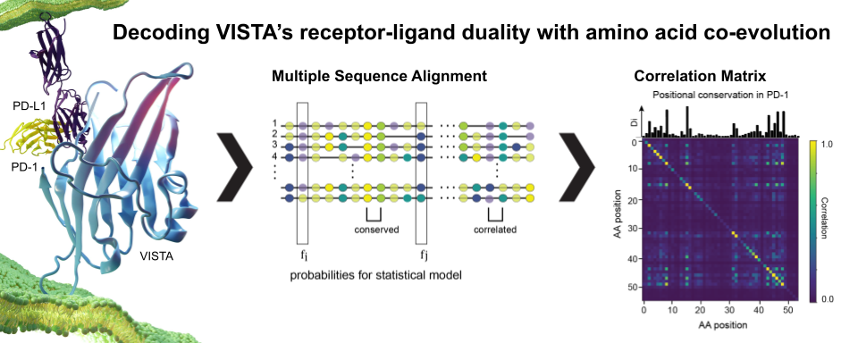

# Statistical Coupling Analysis for the V-set Protein Family

_**Graphical Summary:** Brief introduction >
Generating multiple sequence alignments > Generating a Correlation Matrix_

## Table of Contents
1. **Introduction**
    * Raw data description
    * Installing dependencies
2. **Multiple sequence alignment**
    * Creating your own MSA
    * Annotating your MSA
3. **Generate the correlation matrix**
    * Running the scripts
    * Interpreting the results

## Introduction
### Raw data description

The raw data at the heart of our project is a single binary database file.
This file contains a multiple sequence alignment generated from 60,000 V-set sequences.
Using the pySCA API, the multiple sequence alignment has been enhanced to include phylogenetic metadata.
While this dataset can be easily accessed via the PFam database website,
we have included the processed database file here for ease of use.
You can find it in the _data_ directory.
For the original multiple sequence alignment:

> https://pfam.xfam.org/family/V-set

### Installation

In order to run these calculations, we will need to install some dependencies.
The Ranganathan Lab has included a beautiful tutorial with the pySCA distribution.
Walking though the pySCA installation tutorial will also install all other dependencies.
You can use a package manager like homebrew to keep the installation clean.
The installation is summarized below, but make sure to refer to the Ranganathan tutorial:
https://ranganathanlab.gitlab.io/pySCA/install/

1. Core system dependencies
    > xcode-select --install  
    > brew install python3  
    > brew install gcc  

2. Fasta36
    > git clone https://github.com/wrpearson/fasta36.git  
    > cd fasta36/src  
    > make -j2 -f ../make/Makefile.os_x86_64 all  
    > cp -r ../bin /usr/local  
    > rm /usr/local/bin/README  
    > cd ../..  

3. pySCA
    > git clone https://github.com/ranganathanlab/pySCA.git  
    > cd pySCA-master  
    > pip install .  

4. The pySCA distribution automatically installs the following:
    * numpy
    * scipy
    * argparse
    * wheel
    * matplotlib

## Generating the Summary Histogram and Heatmap

## Citations
1.
